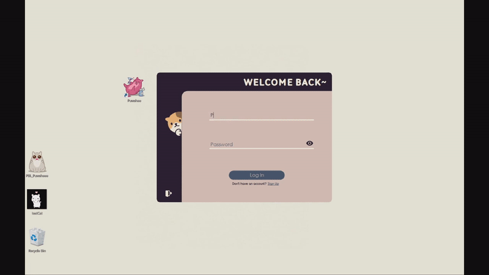
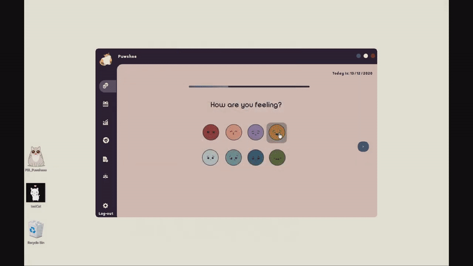

# Puwshee
Puwshee is an application that can encourage the user to maintain a healthy relationship with their self

## Features
- **Mood trackers** that can help determine what triggers the mental state of the user by associating activities with usual moods. Provides data visualization
- **Journaling** that can simply record, edit, save, and delete notes of the user
- **Guided meditation and relaxation** video and audio files installed in the application to help the user
- **Mental health tests** to check how well the user is doing compared to the average. It would also prompt if the score is too low than the standard score for good mental health

### Demo

Check out the whole application walkthrough [here](https://www.youtube.com/watch?v=ba2xLLU_QJE) 

## Tech Used
- C#
- MS SQL
- Microsoft Visual Studio
- Microsoft SQL Server